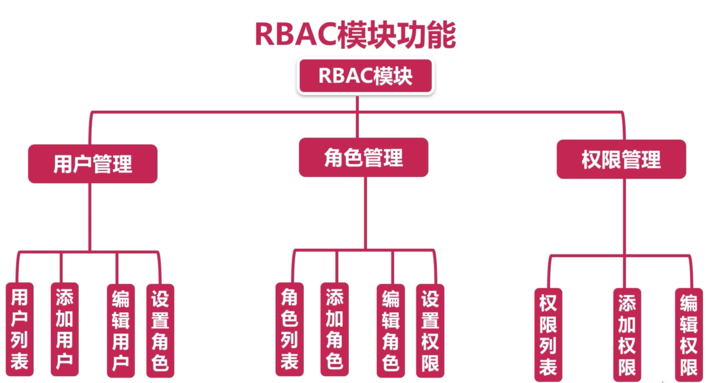
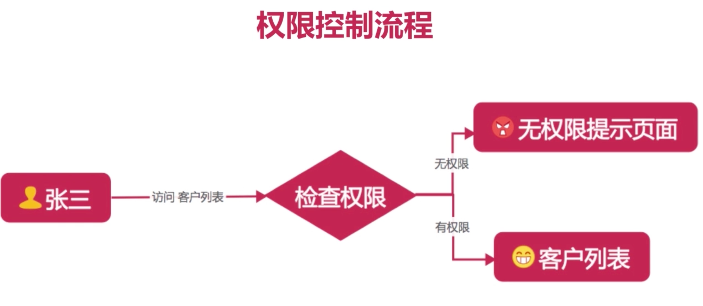

# RBAC 数据库模型框架
@(高咕噜黑小帅)[RBAC|WEB|数据库权限管理模型]

### RBAC 数据表

| 表名 | 表作用 | 例|
| --- | --- | --- |
| 用户表 | 存储用户 | 高亚星 张小五|
| 角色表 | 用户所属于角色 | 程序员 前台 总经理 |
| 用户角色关系表 | 用户与角色之间关联 | 高亚星是程序员 张小五是前台 头小大是总经理 |
| 权限表 | 可以访问的权限 | URL 客户列表 添加客户 财务报表 |
| 角色权限关系表 | 用户拥有的权限 | 高亚星是超级用户 张小五可以查看客户 |


```sequence
用户表->用户角色关系表: 用户属于哪些角色
用户角色关系表->用户表: 用户属于哪些角色
角色表->用户角色关系表: 角色拥有哪些用户
用户角色关系表->角色表: 角色拥有哪些用户
角色表->角色关系表: 角色拥有哪些操作
角色关系表->角色表: 角色拥有哪些操作
角色关系表->权限表: 角色拥有哪些权限
```
 
 

 ### RBAC 模块功能
                                                 RBAC功能
                                                    |
              ------------------------------------------------------------------------------
              |                                     |                                      |
              |                                     |                                      |
       ----用户管理----                       ----角色管理----                      -----权限管理----
       用   添   编   设                      角   添   编   设                     权   添   编    取     
       户   加   辑   置                      色   加   辑   置                     限   加   辑    消     
       列   用   用   角                      列   角   角   权                     列   权   权    权     
       表   户   户   色                      表   色   色   限                     表   限   限    限     
 




### 数据库设计

```sql
CREATE TABLE user(  -- 一.用户表 
id INT(11),
name VARCHAR(20),
email VARCHAR(20),
is_admin TINYINT(1),
status TINYINT(1),
updated_time TIMESTAMP,
created_time TIMESTAMP,
PRIMARY KEY (id)
);
```

```sql
CREATE TABLE role(      -- 二. 角色表
id INT(11),
name VARCHAR(50),
status TINYINT(1),
updated_time TIMESTAMP,
created_time TIMESTAMP,
PRIMARY KEY (id)
);
```

```sql
CREATE TABLE user_role(     -- 三.用户角色表关系表
id INT(11),
uid INT(11),
role_id INT(11),
created_time TIMESTAMP,
PRIMARY KEY (id)
);
```

```sql
CREATE TABLE access(    -- 四.权限表
id INT(11) NOT NULL AUTO_INCREMENT,
title VARCHAR(50),
urls VARCHAR(1000),
status TINYINT(1),
updated_time TIMESTAMP,
created_time TIMESTAMP,
PRIMARY KEY (id)
);
```

```sql
CREATE TABLE role_access(   -- 五.角色权限关系表
id INT(11),
role_id INT(11),
access_id INT(11)
created_time TIMESTAMP,
PRIMARY KEY (id)
);
```